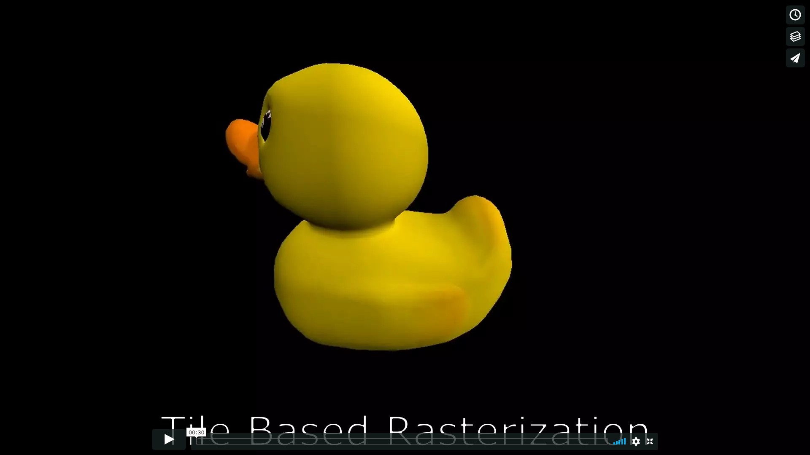
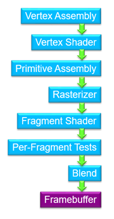
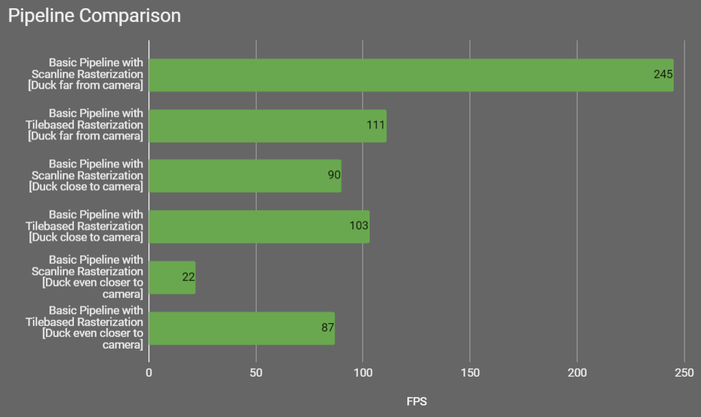
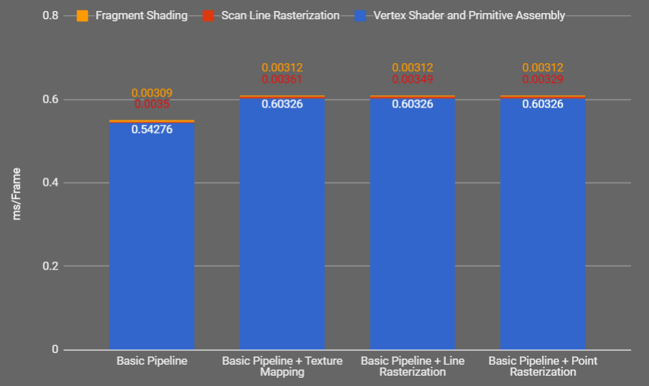
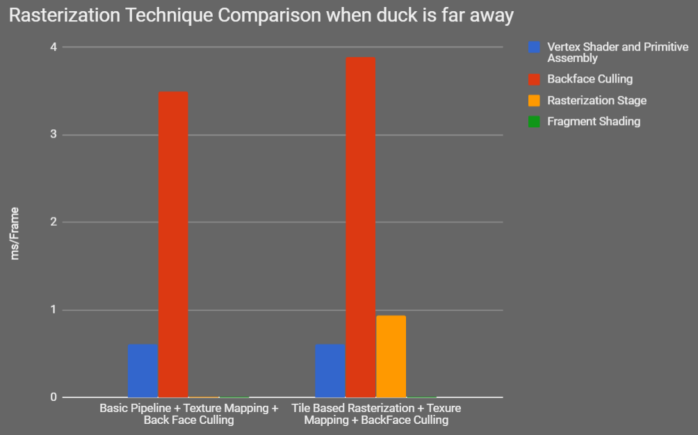

CUDA Rasterizer
===============

**University of Pennsylvania, CIS 565: GPU Programming and Architecture, Project 3**

* Aman Sachan
* Tested on: Windows 10, i7-7700HQ @ 2.8GHz 32GB, GTX 1070(laptop GPU) 8074MB (Personal Machine: Customized MSI GT62VR 7RE)

## Overview

Rasterization (or rasterisation) as defined by wikipedia is the task of taking an image described in a vector graphics format (shapes) and converting it into a raster image (pixels or dots).

In this project, I simulated the rasterization process of a GPU using CUDA kernels. The aim of this project was to learn the graphics pipeline more intimately while also gaining an appreciation for the GPU's existing rasterization capabilities. 

The pipeline I implemented here is a fairly simple one. It consists of:
	- Vertex input assembly
	- Vertex shading 
	- Primitive assembly
	- Backface culling
	- Rasterization
	- Per fragment depth test
	- Fragment shading

## Features

### Tile Based Rasterizarion

Tile Based Rasterization is a technique that is commonly seen on low-power devices like mobile phones; it however is gaining popularity and has been [adopted by Nvidia as the defacto rasterization technique](https://www.realworldtech.com/tile-based-rasterization-nvidia-gpus/) since the maxwell architecture.

Tiled rasterization simply cuts up the output image into a grid of 2D tiles that are then dealt with separately. As a preprocess step all the primitives in the scene are binned into different tiles using their bounding boxes. Then, during the actual rasterization stage a separate kernel is launched for each tile that deals with only those primitives that happened to be binned into that tile. And those are pretty much the only major differences that tiled rasterization introduces as compared to a regular scanline implementaion.

Performance wise there is a 3X increase in the framerate when the window space triangles are distributed over most of the tiles. This is mostly because tile based is more stable in terms of performance whereas there is an exponential drop for regular scanline rasterization.
If however, all the triangles exist inside a few tiles the technique is pretty useless. Fortunately, in real world applications triangles are pretty evenly distributed and binning them into tiles greatly increases the framerate. Performance for tile based rasterization can be simplified to the time complexity of the numberOfPixels x (numberOfPrimitives/numTiles) assuming we have a uniform distribution of triangles in window space.

### ScanLine Rasterization

ScanLine Rasterization is the most common rasterization technique. Scanline literally scans pixels row-wise to create a picture. This can be optimized by the use of Bounding boxes for each primitive and then only performing scanline inside the primitive. Other basic optimizations include using the line intersection testing to determine the start and end points of every row being evaluated (a triangle cant occupy the entirety of its bounding box, usually a triangle fills close to half of its bounding box). In my scanline implementation, a kernel parallelized over the number of primitives is launched, and then scanline is performed over the bounding box of each primitive.

Performance of scanline rasterization is pretty good although it usually cannot compete with tile based rendering. My implementation of scanline rasterization was used as a baseline to compare every feature against. However, it is about half as fast as tile based rasterization.
Performance for scanline rasterization can be simplified to the time complexity of the numberOfPixels x numberOfPrimitives assuming we have a uniform distribution of triangles in window space.

### Texture Mapping

Texture Mapping is a technique that maps a 2D image onto a 3D object; it is also used to define high frequency detail on 3D models. As would be expected it texture mapping only hurts performance. However textures are still worth all the frames they use because the alternative is too computationally intensive and is a nightmare for artists. The overall impact reading textures can be reduced by streamlining data and make it cache coherent. Essentially anything that reduces global memory reads.

### Perspective Correct Interpolation of values

Transforming positions from View space to NDC space involves perspective division. This can introduce artifacts in textures if it isnt taken into account during color interpolation for fragments. Perspective Correct Interpolation doesn't add much if anything to the computational cost of barycentric interpolation.

### Bilinear Filtering

Bilinear filtering is a texture filtering method used to smooth textures when displayed larger or smaller than they actually are, which is almost all the time. Bilinear filtering essentially bilinearly interpolates between the 4 pixels surrounding the look up point. It makes images look much much better and not pixelated. However, it does introduces slight artifacts that can be removed with better but more expensive filtering methods such as trilinear filtering.

### Depth Test

A depth test is used to ensure that only the fragments that can be seen by the camera are drawn (assuming there isnt transparency). In practice, this means if there are a thousand triangles in a line behind the camera then only the fragment from the first camera will be drawn or written into. In a GPU rasterizer, the depth test has to be performed atomically or with mutexes. This is because in a parallelised kernel, multiple threads can try and write to the fragment buffer at the same time at the same location. This is a "race condition." There is no guarantee as to which thread will finish writing to it last. To avoid this, I used a mutex that basically acts as a lock. A mutex array contatains a lock for every index of the fragment buffer. Atomics are operations that guarantee serial operation amongst parallel threads. Atomics however dont prevent race conditions between different blocks launched by a kernel. Thus they can produce rare race conditions that show up as a few blinking pixels.

Performance wise Depth Testing leads to a big hit in the framerate because we have serialized what was once a parallel section of our code.

### Backface Culling

In a 3D scene there are objects that will not be seen by camera because they aren't facing the camera. It is a good idea to simply ignore these triangles as they dont generally add to the final image.

### Different Primitive Types

Just like OpenGL, my implementation of a rasterizer allows for drawing meshes as lines and also as point clouds.

#### Wireframe (Lines)

Equivalent to GL_LINES.

#### Point Cloud (Points)

Equivalent to GL_POINTS.

### Shading Models:

Shading models are what sell the illusion that is rasterization. Great shading models can turn a scene into a believable landscape. I have implemented the standard lambertian shading model along with debug shading models.

#### Lambertian
#### Depth Shading
#### Diffuse Color
#### Normals
#### Absolute Normals

### Credits

* [tinygltfloader](https://github.com/syoyo/tinygltfloader) by [@soyoyo](https://github.com/syoyo)
* [glTF Sample Models](https://github.com/KhronosGroup/glTF/blob/master/sampleModels/README.md)